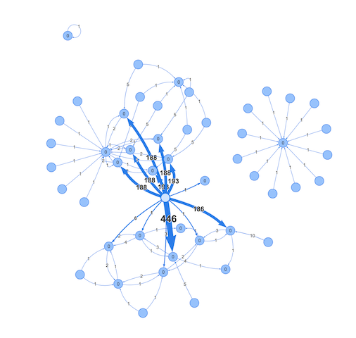

# akka-visualmailbox

[](https://travis-ci.org/ouven/akka-visualmailbox)
[](https://img.shields.io)
[](https://img.shields.io)

Current version: 1.0.1

This project wants to help you finding hotspots in your Akka application by visualizing your message flows
like it is shown on the next picture. Actors are displayed as nodes, message flows are displayed as arrows.
The thicker an arrow is displayed, the more messages have been sent this way. You can get the actor path by
clicking the nodes. The number shown on a node represents the mailbox size of this actor.   



## collector
The collector is the component that collects the mailbox data and sends it to the visualization server.
To integrate the collector into your project you just have to add the dependency to your build file 
and set the collector mailbox for the akka default dispatcher.

build.sbt
```sbt
libraryDependencies += "de.aktey.akka.visualmailbox" %% "collector" % "1.0.1"
``` 

application.conf:
```
akka.actor.default-mailbox.mailbox-type = "de.aktey.akka.visualmailbox.VisualMailboxType"
```

It will collect your mailbox data and send it in chunks of 40 data sets or at least every second to the visualization server. 

## visualization
The visualisation component receives the mailbox data at `udp://localhost:60009`, which can be changed in the application.conf by overriding
```
de.aktey.akka.visualmailbox {
  server {
    address {
      host: "localhost"
      port: 60009
    }
  }
}
```

It servers a web surface at [http://localhost:8080](http://localhost:8080), that renders the messages with vis.js.
It uses the JavaScript keyword "class" and the "EventSource" API, so it is viewable with Chrome
42+ or Firefox 45+. Other browsers I did not try.

To run the server, you have to have `node.js` an `bower` installed.
To prepare the web part you need to do
```bash
bower install
```
in the project root directory, then
```bash
sbt "project visualization" run
```
to run the server.

## sample-project
The sample project puts it all together, to show the usage and to play arround with pictures. You can run it with
```bash
sbt "project sample-project" run
```
  

## common
The common project contains the protocol and common config stuff. 
